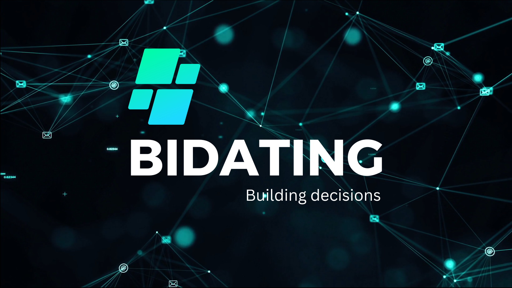
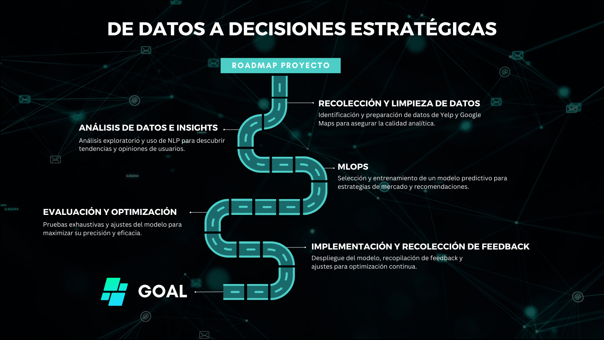

 

# Análisis de Sentimientos en Reseñas de Google Maps y Yelp

### Proyecto Final - Bootcamps de Ciencia de Datos Henry

> _Esta actividad (puramente educativa) corresponde al proyecto final del Bootcamp Henry - Ciencia de Datos. Es parte de nuestro portafolio de prácticas que nos ha permitido mejorar habilidades en Ciencia de Datos con problemas y conjuntos de datos del mundo real._

## Índice
- Introducción
- Contexto
- Estructura del Repositorio
- Roadmap
- Alcance del Proyecto
- Metodología de Trabajo
- Fuente de datos
- Stack Tecnológico
- Equipo BIDATING
- Licencia

## Introducción
Bienvenidos al repositorio del proyecto BIDATING, donde "building decisions" se encuentra con el análisis de datos. Nuestro objetivo es proporcionar insights valiosos a través del análisis de sentimientos de las reseñas de Yelp y Google Maps, para mejorar las estrategias de negocio en el sector de restaurantes y turismo.

## Contexto
La opinión de los usuarios es invaluable, creciendo exponencialmente a través de plataformas de reseñas como Yelp y Google Maps. Este proyecto busca analizar estas reseñas para predecir tendencias de mercado y mejorar la toma de decisiones en el sector de restaurantes y turismo.

## Estructura del Repositorio

├─ [assets](/assets) _Contiene recursos multimedia, imágenes u otros activos utilizados en el proyecto._ 
├─ [dashboard](/dashboard) _Incluye archivos relacionados con la creación y desarrollo de un panel interactivo._ 
├─ [datasets](/datasets) _Almacena los conjuntos de datos utilizados en el proyecto, organizados en carpetas separadas para archivos csv y parquet._ 
├─ [deploy_ml](/deploy_ml) _Esta carpeta abarca todos los elementos relacionados con el despliegue de modelos de aprendizaje automático en Google Cloud._ 
├─ [diagrams](/diagrams) _Esta carpeta contiene diagramas y esquemas visuales relacionados con el pipeline de datos. Explora representaciones gráficas aquí que ilustran la arquitectura, flujos de proceso y otros aspectos visuales relevantes del proyecto._  
├─ [docs](/docs) _Contiene la documentación esencial para el proyecto como: directrices, generalidades, criterios de evaluación, instrucciones para implementar ML, otros._ 
├─ [notebooks](/notebooks) _Aquí, encontrarás cuadernos Jupyter u otros documentos relacionados con la exploración y análisis de datos como ETL/EDA._ 
├─ [sources](/sources) _Esta carpeta contiene scripts y módulos de Python relacionados con el procesamiento de datos, utilidades y funcionalidad del backend. Si buscas los cuadernos Jupyter o documentos relacionados con la exploración y análisis de datos, revisa la carpeta notebooks._  
├─ [videos](/videos) _En esta carpeta, se almacenan archivos relacionados con material visual, como tutoriales, demostraciones o cualquier contenido multimedia en formato de video que sea relevante para el proyecto._ 

## Roadmap
Aquí se describe la hoja de ruta del proyecto, detallando las fases principales.

 

Explorar roadmap

 
### Puntos Clave:

1. **Recolección y Limpieza de Datos**
   - En esta fase inicial, el proyecto se enfoca en la adquisición y preparación meticulosa de conjuntos de datos críticos obtenidos de Yelp y Google Maps. Este proceso incluye la identificación precisa de fuentes de datos relevantes, la extracción eficiente de la información necesaria y la implementación de técnicas avanzadas de limpieza de datos. El objetivo es garantizar la integridad y la alta calidad de los datos, fundamentales para el análisis analítico posterior, eliminando cualquier discrepancia, dato irrelevante o duplicado que pueda sesgar los resultados.

2. **Análisis de Datos e Insights**
   - Esta etapa se dedica al examen profundo y al análisis exploratorio de los datos limpios, utilizando técnicas de procesamiento de lenguaje natural (NLP) y otras metodologías analíticas avanzadas. El propósito es descifrar tendencias, patrones y correlaciones ocultas dentro de las reseñas, extrayendo insights valiosos sobre las percepciones y opiniones de los consumidores. Estos descubrimientos son esenciales para comprender la dinámica del mercado y las expectativas de los clientes, ofreciendo una base sólida para la toma de decisiones estratégicas.

3. **Desarrollo de Modelo de Machine Learning**
   - En el núcleo del proyecto yace el desarrollo de modelos predictivos de machine learning, seleccionados meticulosamente por su capacidad para ofrecer predicciones precisas y accionables. Esta fase implica un riguroso proceso de entrenamiento, validación y ajuste fino de los modelos, con el fin de capturar la esencia de las tendencias de mercado y las preferencias de los consumidores. Los modelos están diseñados para proporcionar recomendaciones estratégicas, apoyando a las empresas en la identificación de oportunidades de crecimiento y en la optimización de sus estrategias de mercado.

4. **Evaluación y Optimización del Modelo**
   - Antes del despliegue final, los modelos pasan por una etapa crítica de evaluación y optimización, donde su rendimiento y precisión son sometidos a pruebas exhaustivas bajo diferentes escenarios y conjuntos de datos de prueba. Esta fase es crucial para asegurar que los modelos no solo sean robustos y generalizables, sino también capaces de adaptarse a las variaciones del mercado y a las necesidades cambiantes de los consumidores. Se implementan ajustes y mejoras basadas en los resultados de estas pruebas, maximizando la eficacia de los modelos.

5. **Implementación y Recolección de Feedback**
   - La fase final marca la implementación de los modelos de machine learning en un entorno de producción real, donde comienzan a influir en las decisiones estratégicas. Paralelamente, se establece un mecanismo continuo de recolección de feedback, permitiendo la evaluación constante del impacto y la eficacia de los modelos. Este feedback es invaluable para el ciclo de mejora continua, donde los modelos se ajustan y refinan en respuesta a los nuevos datos y retroalimentación recibida, asegurando su relevancia y precisión a largo plazo.

    

## Alcance del Proyecto
Este proyecto se enfoca en el análisis de sentimientos de reseñas de Yelp y Google Maps en Estados Unidos, con el objetivo de identificar oportunidades de crecimiento y áreas de mejora para negocios en el sector de restaurantes y turismo.

## Metodología de Trabajo
Utilizamos Scrum como nuestra principal metodología de gestión de proyectos, permitiéndonos trabajar de manera ágil y adaptativa. Otras metodologías que consideramos útiles incluyen Kanban para la gestión de tareas y Lean para optimizar nuestros procesos de trabajo.

Explorar la metodología SCRUM usada por Bidating en este proyecto
 

  

  
Sprint 1

     Contenido aqui
  

  

  
Sprint 2

     Contenido aqui
  

  

  
Sprint 3

     Contenido aqui
  

  

## Fuente de Datos

Este proyecto se basa en un conjunto de datos extenso y detallado para el análisis de sentimientos sobre reseñas de Google Maps y Yelp. Estos datos son fundamentales para comprender las tendencias del mercado, las preferencias de los usuarios y para el desarrollo de modelos predictivos eficaces.

Puedes acceder a los datos a través de los siguientes enlaces:

- [Datos de Yelp](https://drive.google.com/drive/folders/1Wf7YkxA0aHI3GpoHc9Nh8_scf5BbD4DA)
- [Datos de Google Maps](https://drive.google.com/drive/folders/1TI-SsMnZsNP6t930olEEWbBQdo_yuIZF)

Estos conjuntos de datos incluyen información detallada sobre ubicaciones comerciales, categorías, puntajes promedio, reseñas de usuarios, y más. Han sido recopilados con el propósito de proporcionar una base sólida para análisis cualitativo y cuantitativo, apoyando así la toma de decisiones informadas en el sector de restaurantes y turismo.

## Stack Tecnológico

La elección adecuada del stack tecnológico en ciencia de datos es clave para maximizar la eficiencia y el rendimiento, garantizar la escalabilidad, facilitar la colaboración, simplificar el mantenimiento y asegurar una integración fluida. Elegir correctamente permite alinear las herramientas con las necesidades específicas del proyecto, mejorando su capacidad para resolver problemas y adaptarse a cambios futuros, lo que resulta fundamental para el éxito y la sostenibilidad del proyecto.

## Equipo BIDATING

|      |      |      |
| :--: | :--: | :--: |
|  **Marco**   |  **Paulo**   |  **Kevin**   |
|  **Edgar**   |  **Victor**   |  **Fer**   |

## Licencia

Este proyecto está bajo la Licencia MIT, lo que permite el uso, modificación y distribución libres. Para más detalles, vea el archivo [LICENSE](LICENSE.txt) en este repositorio.
